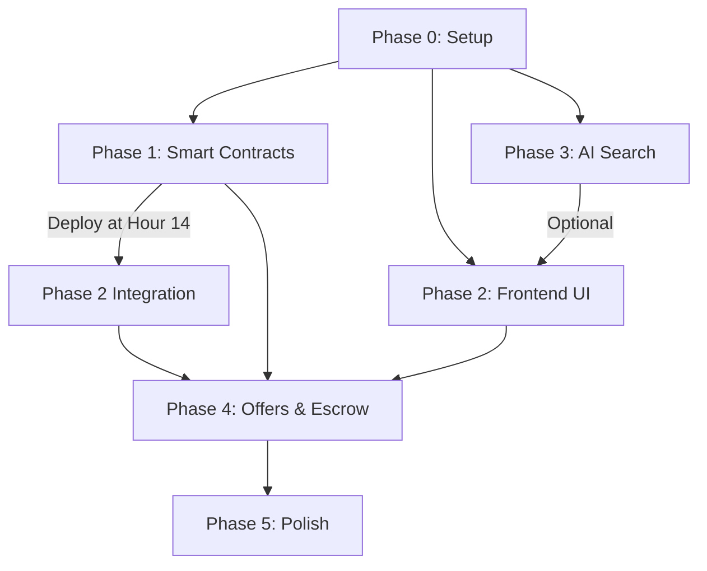

# Task List: ThriftChain MVP Implementation (BLOCKCHAIN-FIRST)

**Based on:** PRD_Final.md (Updated for Decentralized Architecture)
**Generated:** December 2024
**Context:** CalHacks 12 Hackathon (14-hour sprint timeline)

## 🎯 ARCHITECTURE PRINCIPLES

**This is a BLOCKCHAIN-FIRST marketplace:**
1. ✅ **Sui Blockchain** = Source of truth for ALL marketplace data
2. ✅ **Walrus** = Decentralized image storage (blob IDs stored on-chain)
3. ✅ **Supabase** = AI search layer ONLY (vector embeddings, not marketplace data)
4. ✅ **Frontend** = Queries blockchain directly, builds transactions client-side

---

## 📊 CURRENT STATE SUMMARY

### ✅ COMPLETED Infrastructure
- [x] Next.js 16 workspace with TypeScript and Tailwind CSS 4
- [x] Sui wallet integration (@suiet/wallet-kit + Enoki zkLogin)
- [x] Supabase client setup (client.ts, server.ts)
- [x] Walrus client wrapper with upload functions
- [x] Basic UI components (Header, LoginModal, Home page)
- [x] Retro-themed design system
- [x] **NEW:** Supabase schema redesigned for AI-only (3 tables, not 6)
- [x] **NEW:** TypeScript types for on-chain objects (sui-objects.ts)
- [x] **NEW:** Blockchain query utilities (sui/queries.ts)
- [x] **NEW:** Transaction builder utilities (sui/transactions.ts)

### ❌ CRITICAL GAPS
- [ ] **NO Move smart contracts written** (sources/ directory empty)
- [ ] **NO contracts deployed** (THRIFTCHAIN_PACKAGE_ID not set)
- [ ] **NO item listing pages** (/listings, /list-item give 404)
- [ ] **NO AI search implementation** (embeddings, indexing, search APIs)
- [ ] **NO API routes** (only placeholder hello and zklogin)
- [ ] **.env.local not configured** (will crash on startup)

---

## 🧪 TESTING WORKFLOW & DOCUMENTATION

### **MANDATORY: Generate Test Files for Each Task**

**After completing ANY task, you MUST:**

1. **Generate a test markdown file** in `tasks/tests/` directory
2. **File naming convention:** `[task-number]-testing.md`
   - Example: `tasks/tests/1.1-testing.md`
   - Example: `tasks/tests/2.3-testing.md`
   - Example: `tasks/tests/4.7-testing.md`

3. **Test file purposes:**
   - **Human Developer Understanding:** Help developers understand the code being written
   - **Functionality Confirmation:** Verify functionality according to guidelines in `tasks/TESTING-GUIDE.md`
   - **Integration Testing:** Ensure tasks work together properly
   - **Regression Prevention:** Re-test after changes

### **Test File Structure (REQUIRED)**

Each test file must follow this exact structure:

```markdown
# Task [X.Y] Testing Instructions
## [Task Description from PRD]

### Prerequisites
- List of required completed tasks
- Required setup or dependencies
- Environment requirements

---

## Step 1: [First Verification Step]

1. **Action to perform**
2. **Expected output**
3. **Verification method**
4. **Success criteria**

---

## Step 2: [Second Verification Step]

1. **Action to perform**
2. **Expected output**
3. **Verification method**
4. **Success criteria**

---

## Move Contract Testing (Sui-Specific)

### Unit Tests in Move
- [ ] **Test module structure**: Create `*_tests.move` file in `tests/` directory
- [ ] **Test annotations**: Use `#[test]` and `#[test, expected_failure]` properly
- [ ] **Test scenario usage**: Use `test_scenario::begin()` for complex object interactions
- [ ] **Dummy context**: Use `tx_context::dummy()` for simple function tests
- [ ] **Event testing**: Verify events are emitted using `event::events_by_type<T>()`
- [ ] **Clock testing**: Use `clock::create_for_testing()` for time-dependent functions
- [ ] **Assertions**: Use `assert_eq!` instead of `assert!` with equality checks
- [ ] **Cleanup**: Use `destroy_for_testing()` for proper test cleanup

### Move Test Commands
- [ ] **Run tests**: `sui move test` executes all unit tests
- [ ] **Test specific module**: `sui move test --filter <module_name>`
- [ ] **Test with gas**: `sui move test --gas-budget <amount>`
- [ ] **Test coverage**: `sui move test --coverage` (if available)

### Integration Testing
- [ ] **Local network testing**: Use `sui start` for local development
- [ ] **Testnet deployment**: Deploy to testnet for integration testing
- [ ] **Transaction testing**: Test full transaction flows with real objects
- [ ] **Event subscription**: Test real-time event handling
- [ ] **Gas estimation**: Verify gas costs are reasonable

---

## Success Criteria Checklist

- [ ] Criteria 1: [Specific, measurable outcome]
- [ ] Criteria 2: [Specific, measurable outcome]
- [ ] Criteria 3: [Specific, measurable outcome]
- [ ] **Move unit tests pass**: `sui move test` returns success
- [ ] **Integration tests pass**: Full transaction flow works on testnet
- [ ] **Events verified**: All expected events are emitted correctly
- [ ] **Gas costs reasonable**: Transaction gas costs are within acceptable limits

---

## Troubleshooting

### Common Error: [Description]
**Solution:** [How to fix]

### Common Error: [Description]
**Solution:** [How to fix]

### Sui-Specific Errors

#### "TestScenario not properly cleaned up"
**Solution:** Ensure `test_scenario::end()` is called in all test functions

#### "Clock testing functions not available"
**Solution:** Use `clock::create_for_testing()` and related testing functions

#### "Event not found in test"
**Solution:** Use `event::events_by_type<T>()` to query emitted events

#### "Gas budget exceeded"
**Solution:** Increase gas budget or optimize contract functions

---

## Next Steps

After completing Task X.Y, proceed to **Task X.Z**: [Next task description]
```

### **Testing Requirements**

**For EVERY task, the test file must include:**

1. **Prerequisites verification** - Check previous tasks are complete
2. **Step-by-step verification** - Manual testing steps with expected outputs
3. **Success criteria checklist** - Measurable outcomes
4. **Troubleshooting section** - Common errors and solutions
5. **Integration verification** - Ensure task works with existing system
6. **Next steps guidance** - Clear path to next task

### **Move Contract Testing Requirements (Sui-Specific)**

**For Move contract tasks (Phase 1), test files must additionally include:**

1. **Unit test verification** - `sui move test` command execution and results
2. **Test scenario validation** - Proper use of `test_scenario::begin()` and `test_scenario::end()`
3. **Event emission testing** - Verification that events are emitted correctly
4. **Clock testing** - Time-dependent function testing with `clock::create_for_testing()`
5. **Gas cost verification** - Ensure gas costs are reasonable and within limits
6. **Integration testing** - Full transaction flow testing on testnet
7. **Error condition testing** - Use `#[test, expected_failure]` for error cases
8. **Object lifecycle testing** - Proper object creation, transfer, and destruction

### **Testing Philosophy**

- **Manual Verification First:** All tests designed for human developers
- **Incremental Testing:** Each test builds on previous tasks
- **Security-First:** Verify security configurations and access controls
- **Integration Focus:** Tests verify integration, not just isolation
- **Documentation:** Tests serve as living documentation

### **Testing Workflow**

```bash
# 1. Complete the task implementation
# 2. Generate test file: tasks/tests/[task-number]-testing.md
# 3. Follow all verification steps manually
# 4. Verify all success criteria
# 5. Only mark task complete (✅) after all tests pass
# 6. Update tasks-PRD_Final.md with checkmark
# 7. Proceed to next task
```

### **Quality Assurance**

- **No task is complete without passing tests**
- **Test files must be generated before marking complete**
- **All success criteria must be verified**
- **Integration with existing system must be confirmed**

---

## 📋 REVISED TASK LIST (BLOCKCHAIN-FIRST)

### 🔥 PHASE 0: Critical Blockers (MUST DO FIRST)

- [ ] **0.1** Create `.env.local` with Supabase credentials
  - `NEXT_PUBLIC_SUPABASE_URL`
  - `NEXT_PUBLIC_SUPABASE_ANON_KEY`
  - `SUPABASE_SERVICE_ROLE_KEY`
  - Test: Can import supabaseClient without errors

- [ ] **0.2** Deploy NEW Supabase schema (AI-only, 3 tables)
  - Run `frontend/supabase-schema.sql` in Supabase SQL Editor
  - Verify tables: `item_search_index`, `user_ai_preferences`, `search_cache`
  - Test: Can query tables without errors

- [ ] **0.3** Install Sui CLI and configure testnet wallet
  - `brew install sui` or download from sui.io
  - `sui client new-env --alias testnet --rpc https://fullnode.testnet.sui.io:443`
  - `sui client new-address ed25519`
  - Get test SUI tokens from faucet
  - Test: `sui client gas` shows balance

---

### 🏗️ PHASE 1: Smart Contracts (FOUNDATION - DO SECOND)

**Priority:** CRITICAL - Nothing works without these!

- [x] **1.1** Create Move contract directory structure
  - `mkdir -p contracts/marketplace/sources`
  - Verify Move.toml exists with correct Sui framework dependency
  - Test: `cd contracts/marketplace && sui move build` succeeds (will fail until contract exists)

- [x] **1.2** Write `thriftchain.move` - ThriftItem struct & create_item function
  - Define `ThriftItem` Move struct with all fields (title, description, price, walrus_image_ids, etc.)
  - Implement `create_item()` entry function to mint item NFT
  - Add events: `ItemCreated`
  - Test: `sui move build` compiles without errors
  - **File:** `contracts/marketplace/sources/thriftchain.move`

- [ ] **1.3** Write Offer system in Move contract with counter-offer negotiation
  - Define `Offer` Move struct (item_id, buyer, seller, amount, message, status, expires_at, is_counter)
  - Define event structs: `OfferCreated`, `OfferCountered`, `OfferCancelled`, `OfferRejected` (all with copy + drop abilities)
  - Implement `create_offer()` entry function - buyer makes initial offer
  - Implement `counter_offer()` entry function - seller counters with new price
  - Implement `accept_counter_offer()` entry function - buyer accepts counter
  - Implement `cancel_offer()` entry function - buyer cancels own offer
  - Implement `reject_offer()` entry function - seller rejects offer
  - Emit appropriate events in each function using `sui::event::emit()`
  - Test: `sui move build` compiles without errors

- [ ] **1.4** Write Escrow system in Move contract
  - Define `Escrow` Move struct (buyer, seller, item_id, amount, status)
  - Implement `accept_offer()` - creates escrow, locks item
  - Implement `confirm_delivery()` - releases funds to seller, transfers item to buyer
  - Implement `dispute_escrow()` - marks escrow as disputed
  - Implement `refund_escrow()` - returns funds to buyer
  - Add events: `OfferAccepted`, `ItemSold`, `EscrowDisputed`, `EscrowRefunded`
  - Test: `sui move build` compiles

- [ ] **1.5** Write item management functions in Move contract
  - Implement `update_item_price()` - seller can change price
  - Implement `cancel_item()` - seller can cancel listing
  - Implement `mark_as_sold()` - automatically called when escrow completes
  - Add events: `ItemPriceUpdated`, `ItemCancelled`, `ItemMarkedAsSold`
  - Emit events in each function using `sui::event::emit()`
  - Test: `sui move build` compiles, all functions present

- [ ] **1.6** Deploy contracts to Sui testnet
  - `cd contracts/marketplace && sui client publish --gas-budget 100000000`
  - Save Package ID from output
  - Save all created object IDs
  - Test: Can see package on Sui Explorer (https://suiexplorer.com/?network=testnet)

- [ ] **1.7** Update frontend config with deployed contract address
  - Add `NEXT_PUBLIC_THRIFTCHAIN_PACKAGE_ID=0x...` to `.env.local`
  - Update `frontend/src/lib/sui/queries.ts` to use env variable
  - Test: Import `THRIFTCHAIN_PACKAGE_ID` in frontend without errors

- [ ] **1.8** Test contract functions end-to-end on testnet
  - Use Sui CLI to call `create_item` and verify item NFT minted
  - Use Sui CLI to call `create_offer` and verify offer created
  - Use Sui CLI to call `accept_offer` and verify escrow created
  - Test: Can query created objects with `sui client object <id>`

---

### 🎨 PHASE 2: Frontend - Item Listing Flow (DO THIRD)

**Priority:** HIGH - Users need to list items to populate marketplace

- [ ] **2.1** Create TypeScript types for API responses
  - Create `frontend/src/lib/types/api.ts`
  - Define types for API request/response bodies
  - Define error response types
  - Test: Can import types without errors

- [ ] **2.2** Create Walrus upload API route
  - `frontend/src/app/api/walrus/upload/route.ts`
  - POST endpoint: accepts File, returns Walrus blob ID
  - Use `uploadToWalrus()` from `lib/walrus/client.ts`
  - Return JSON: `{ blobId: string, url: string }`
  - Test: Can POST image file and get blob ID back

- [ ] **2.3** Build ItemForm component for creating listings
  - `frontend/src/components/ItemForm.tsx`
  - Form fields: title, description, price, category, tags, images (multi-upload)
  - Image upload: POST to `/api/walrus/upload`, store blob IDs
  - On submit: Build Sui transaction using `buildCreateItemTransaction()`
  - Connect to wallet, sign transaction, execute on-chain
  - Test: Can fill form, upload images, see transaction succeed

- [ ] **2.4** Create /list-item page
  - `frontend/src/app/list-item/page.tsx`
  - Render ItemForm component
  - Show wallet connection requirement
  - After successful listing, redirect to item detail page
  - Test: Navigate to /list-item, see form, can create listing

- [ ] **2.5** Build ItemCard component for displaying items
  - `frontend/src/components/ItemCard.tsx`
  - Display: image (from Walrus), title, price, category, seller (shortened)
  - Click → navigate to `/items/[objectId]`
  - Test: Can render item card with mock data

- [ ] **2.6** Create /listings browse page
  - `frontend/src/app/listings/page.tsx`
  - Query items from blockchain using `getAllItems()`
  - Display grid of ItemCard components
  - Add loading state, empty state
  - Test: Can see listed items, click to view details

- [ ] **2.7** Create /items/[id] detail page
  - `frontend/src/app/items/[id]/page.tsx`
  - Query single item from blockchain using `getItemById(objectId)`
  - Display: full images, description, price, seller info
  - Show "Make Offer" button if not owner
  - Show "Cancel Listing" button if owner
  - Test: Can view item details, images load from Walrus

- [ ] **2.8** Implement Make Offer functionality
  - Build offer transaction using `buildCreateOfferTransaction()`
  - Modal for entering offer amount and message
  - Sign and execute transaction
  - Show success/error feedback
  - Test: Can make offer on item, see transaction succeed

---

### 🤖 PHASE 3: AI Search Layer (DO FOURTH)

**Priority:** MEDIUM - Nice-to-have for better UX

- [ ] **3.1** Create embeddings utility
  - Create `frontend/src/lib/ai/embeddings.ts` (use basic implementation or OpenAI API)
  - Implement `embedText(text: string): Promise<number[]>`
  - Implement `generateItemEmbeddings(item): Promise<{titleEmbedding, descriptionEmbedding, combinedEmbedding}>`
  - Test: Can generate 1536-dim vector from text

- [ ] **3.2** Create indexing API route
  - `frontend/src/app/api/ai/index-item/route.ts`
  - POST endpoint: accepts Sui object ID
  - Fetch item data from blockchain using `getItemById()`
  - Generate embeddings for title, description, combined
  - Insert into Supabase `item_search_index` table
  - Test: Can POST object ID, see row in Supabase

- [ ] **3.3** Create event listener for auto-indexing (optional)
  - Listen to blockchain events (`ItemCreated`)
  - Automatically call `/api/ai/index-item` when new item minted
  - OR: Manual indexing button on item detail page
  - Test: New items automatically appear in search index

- [ ] **3.4** Create semantic search API route
  - `frontend/src/app/api/ai/search/route.ts`
  - POST endpoint: accepts search query text
  - Generate embedding for query
  - Call Supabase function `search_items_by_embedding()`
  - Return array of Sui object IDs with similarity scores
  - Test: Can search "vintage jacket", get relevant object IDs

- [ ] **3.5** Integrate search into /listings page
  - Add search bar component
  - On search submit: Call `/api/ai/search`
  - Fetch full item data from blockchain using returned object IDs
  - Display results
  - Test: Search works, shows relevant items

- [ ] **3.6** Implement user preferences tracking
  - Track when user views item (POST to `/api/ai/track-interaction`)
  - Store in Supabase `user_ai_preferences` table
  - Generate user preference vector from viewed items
  - Test: Viewing items updates preferences

- [ ] **3.7** Create recommendations API route
  - `frontend/src/app/api/ai/recommendations/[wallet]/route.ts`
  - Call Supabase function `get_user_recommendations(wallet)`
  - Return recommended Sui object IDs
  - Test: Can get personalized recommendations

- [ ] **3.8** Add "For You" section to home page
  - Query recommendations API
  - Fetch items from blockchain
  - Display as carousel or grid
  - Test: See personalized recommendations on home page

---

### 💰 PHASE 4: Offers & Escrow Flow (DO FIFTH)

**Priority:** CRITICAL - Core marketplace functionality

- [ ] **4.1** Create OffersList component
  - `frontend/src/components/OffersList.tsx`
  - Display offers for an item
  - Show: buyer address, amount, message, status, timestamp
  - If seller: Show "Accept" / "Reject" buttons
  - If buyer: Show "Cancel" button
  - Test: Can display mock offers

- [ ] **4.2** Create React hooks for Sui event subscriptions
  - Create `frontend/src/hooks/useOfferEvents.ts`
  - Implement `useOfferEvents(itemId)` hook that subscribes to offer events
  - Use `suiClient.subscribeEvent()` to listen for events
  - Filter events by item ID
  - Return state with offers array and loading/error states
  - Clean up subscription on unmount
  - Test: Hook receives events when offers are made/countered/cancelled

- [ ] **4.3** Integrate offers into item detail page
  - Add OffersList component to `/items/[id]` page
  - Use `useOfferEvents(itemId)` hook for real-time updates
  - Query initial offers using `getOffersByItem(itemId)`
  - Merge real-time events with initial query results
  - Update UI when events received
  - Test: Can see all offers on item, updates in real-time when new offer made

- [ ] **4.4** Implement Counter Offer functionality (seller side)
  - Add "Counter Offer" button on each pending offer
  - Build transaction using `buildCounterOfferTransaction()` (add to transactions.ts)
  - Modal for entering counter offer amount
  - Sign and execute transaction
  - Show success feedback, UI updates via event
  - Test: Seller can counter an offer, buyer sees counter in real-time

- [ ] **4.5** Implement Accept Counter Offer functionality (buyer side)
  - Show counter offer details in OffersList
  - Add "Accept Counter" button for buyer
  - Build transaction using `buildAcceptCounterOfferTransaction()` (add to transactions.ts)
  - Creates escrow with counter offer amount
  - Sign and execute transaction
  - Test: Buyer can accept counter offer, escrow created

- [ ] **4.6** Implement Reject Offer functionality (seller side)
  - Add "Reject" button on each pending offer
  - Build transaction using `buildRejectOfferTransaction()` (already exists)
  - Show confirmation modal
  - Sign and execute transaction
  - Offer status changes, buyer notified via event
  - Test: Seller can reject offer, UI updates in real-time

- [ ] **4.7** Implement Accept Offer functionality
  - Build transaction using `buildAcceptOfferTransaction()`
  - Show confirmation modal with escrow details
  - Sign and execute transaction
  - Navigate to escrow/transaction page
  - Test: Seller can accept offer, escrow created

- [ ] **4.8** Create /transactions page
  - `frontend/src/app/transactions/page.tsx`
  - Show tabs: "Buying" and "Selling"
  - Query escrows using `getEscrowsByBuyer()` and offers by seller
  - Display escrow status, item, amount, delivery confirmation
  - Test: Can see active transactions

- [ ] **4.9** Create React hook for transaction event subscriptions
  - Create `frontend/src/hooks/useTransactionEvents.ts`
  - Implement `useTransactionEvents(userAddress)` hook
  - Subscribe to escrow events: `OfferAccepted`, `ItemSold`, `EscrowDisputed`, `EscrowRefunded`
  - Filter events by buyer or seller address
  - Return state with transactions array and updates
  - Test: Hook receives real-time transaction updates

- [ ] **4.10** Implement Confirm Delivery functionality
  - On /transactions page, show "Confirm Delivery" button for buyers
  - Build transaction using `buildConfirmDeliveryTransaction()`
  - Sign and execute
  - Show success: funds released, item transferred
  - UI updates in real-time via `ItemSold` event
  - Test: Buyer can confirm delivery, escrow completes

- [ ] **4.11** Implement Dispute functionality
  - Add "Dispute" button on escrow page
  - Build transaction using `buildDisputeEscrowTransaction()`
  - Add reason field
  - Sign and execute
  - UI updates via `EscrowDisputed` event
  - Test: Can dispute escrow, status changes

- [ ] **4.12** Implement Refund functionality (admin/seller)
  - For disputed escrows, admin/seller can refund
  - Build transaction using `buildRefundEscrowTransaction()`
  - Sign and execute
  - Funds returned to buyer
  - UI updates via `EscrowRefunded` event
  - Test: Disputed escrow can be refunded

---

### 🎨 PHASE 5: Polish & UX (DO LAST)

**Priority:** LOW - Nice-to-have improvements

- [ ] **5.1** Add loading states to all pages
  - Skeleton loaders for ItemCard
  - Spinner for transaction execution
  - Loading overlay for image uploads

- [ ] **5.2** Add error handling and user feedback
  - Toast notifications for success/errors
  - Graceful error messages for failed transactions
  - Retry buttons for failed operations

- [ ] **5.3** Optimize performance
  - Lazy load images from Walrus
  - Pagination for item listings
  - Cache blockchain queries (short TTL)

- [ ] **5.4** Mobile responsive design
  - Test on mobile breakpoints
  - Adjust layout for small screens
  - Touch-friendly buttons

- [ ] **5.5** Add user profile page
  - `/profile/[wallet]` page
  - Show: items listed, items purchased, reputation
  - Query blockchain for user's items and transactions

- [ ] **5.6** Implement search filters
  - Category filter
  - Price range filter
  - Tags filter
  - Sort by: newest, price low-high, price high-low

- [ ] **5.7** Add notification center with Sui event aggregation
  - Create notification center component
  - Aggregate events from `useOfferEvents` and `useTransactionEvents` hooks
  - Show notifications for: new offers, counter offers, accepted offers, delivery confirmations
  - Show badge count of unread notifications
  - Persist notification read status in localStorage
  - Test: See real-time notifications when blockchain events occur

---

## 🧪 TESTING WORKFLOW

**After Each Task (MANDATORY):**
1. ✅ Complete the task implementation
2. 📝 Generate test file: `tasks/tests/[task-number]-testing.md`
3. 🧪 Follow all verification steps in the test file
4. ✅ Verify all success criteria are met
5. ✅ Only mark task complete (✅) after all tests pass
6. 📋 Update tasks-PRD_Final.md with checkmark
7. ➡️ Proceed to next task

**After Each Phase:**
1. ✅ Complete alFl tasks in phase (with individual test files)
2. 🧪 Test end-to-end flow for that phase
3. 📋 Document any bugs/issues
4. ✅ Fix critical bugs before moving to next phase
5. ➡️ Proceed to next phase

**Testing Checklist:**
- [ ] Can connect wallet (Suiet or zkLogin)
- [ ] Can upload images to Walrus
- [ ] Can mint item NFT on Sui
- [ ] Can browse items from blockchain
- [ ] Can make offer on item
- [ ] Can see offers in real-time (event subscription)
- [ ] Seller can counter offer with new price
- [ ] Buyer can accept counter offer
- [ ] Seller can reject offer
- [ ] Seller can accept offer (creates escrow)
- [ ] Can confirm delivery (completes transaction)
- [ ] Notifications update in real-time via Sui events
- [ ] Can search items (AI search)
- [ ] Can see recommendations
- [ ] Mobile responsive

---

## 📁 KEY FILES REFERENCE

### Blockchain Layer
- `contracts/marketplace/sources/thriftchain.move` - Move smart contracts
- `contracts/marketplace/Move.toml` - Package manifest
- `frontend/src/lib/sui/queries.ts` - Query blockchain (read)
- `frontend/src/lib/sui/transactions.ts` - Build transactions (write)
- `frontend/src/lib/types/sui-objects.ts` - TypeScript types for on-chain objects

### Storage Layer
- `frontend/src/lib/walrus/client.ts` - Walrus upload/download
- `frontend/src/app/api/walrus/upload/route.ts` - Upload API

### AI Search Layer
- `frontend/supabase-schema.sql` - AI-only schema (3 tables)
- `frontend/src/lib/ai/embeddings.ts` - Generate vectors
- `frontend/src/app/api/ai/index-item/route.ts` - Index items
- `frontend/src/app/api/ai/search/route.ts` - Semantic search

### Frontend Pages
- `frontend/src/app/page.tsx` - Home page
- `frontend/src/app/list-item/page.tsx` - Create listing
- `frontend/src/app/listings/page.tsx` - Browse items
- `frontend/src/app/items/[id]/page.tsx` - Item details
- `frontend/src/app/transactions/page.tsx` - User transactions

### Components
- `frontend/src/components/Header.tsx` - Nav header
- `frontend/src/components/ItemForm.tsx` - Create/edit item form
- `frontend/src/components/ItemCard.tsx` - Display item card
- `frontend/src/components/OffersList.tsx` - Display offers

### React Hooks
- `frontend/src/hooks/useOfferEvents.ts` - Real-time offer event subscriptions
- `frontend/src/hooks/useTransactionEvents.ts` - Real-time transaction event subscriptions

---

## 🎯 CRITICAL PATH (MUST COMPLETE FOR MVP)

```
Phase 0 (Blockers) → Phase 1 (Smart Contracts) → Phase 2.1-2.7 (Item Listing) → Phase 4.1-4.10 (Offers & Escrow)
```

**Minimum Viable Demo (14-hour version):**
1. User can list item (upload to Walrus, mint NFT on Sui)
2. Another user can browse items (query blockchain)
3. User can make offer (create on-chain Offer)
4. Seller can accept offer (create on-chain Escrow)
5. Buyer can confirm delivery (release escrow, transfer item)

**SIMPLIFIED FOR 14 HOURS:**
- ❌ Skip counter-offers (too complex!)
- ❌ Skip disputes & refunds (not critical)
- ❌ Skip real-time events (use polling or manual refresh)
- ✅ Focus: List → Browse → Offer → Accept → Confirm

**AI Search (Phase 3) is OPTIONAL** - skip entirely if behind schedule!

---

## ⏱️ TIME ESTIMATES (14-hour sprint)

- Phase 0: 0.5 hours (do together quickly)
- Phase 1: 4-5 hours (smart contracts - Dev 1 focus)
- Phase 2: 3-4 hours (UI with mocks - Dev 2 parallel)
- Phase 3: 2-3 hours (AI search - Dev 3 parallel, OPTIONAL)
- Phase 4: 3-4 hours (offers & escrow - all devs together)
- Phase 5: 1 hour (critical polish only)

**Total Core (0+1+2+4): 11-14 hours** - Tight but achievable with parallel work!

**Note:** Phase 3 (AI Search) is OPTIONAL - skip if behind schedule. Focus on blockchain + UI first.

---

## 📝 NOTES

- **ALWAYS query blockchain for source of truth** - Supabase is just for AI search
- **Use Sui events for real-time updates** - No centralized messaging/Supabase Realtime needed
- **Test on Sui testnet** - Use testnet tokens, don't deploy to mainnet
- **Keep Move contracts simple** - Focus on working functionality over advanced features
- **Emit events in every Move function** - Required for frontend real-time updates
- **Blockchain writes are expensive** - Design to minimize transactions
- **Image optimization** - Compress images before Walrus upload to save storage costs
- **Event subscriptions require cleanup** - Always unsubscribe in React hooks to prevent memory leaks

---

## 👥 TEAM ASSIGNMENT (3 Developers)

### **DEV 1: Blockchain Engineer** 🔗
**Responsibilities:** Smart Contracts (Phase 1)
**Skills Required:** Move/Rust, blockchain architecture
**Timeline:** Hours 0-5 (includes deployment)

**Tasks:**
- [ ] 1.1 - Create Move contract directory structure
- [ ] 1.2 - Write ThriftItem struct & create_item function
- [ ] 1.3 - Write Offer system with counter-offer negotiation (COMPLEX!)
- [ ] 1.4 - Write Escrow system
- [ ] 1.5 - Write item management functions
- [ ] 1.6 - **🔥 DEPLOY to testnet** (Critical milestone at Hour 5!)
- [ ] 1.7 - Share package ID with team
- [ ] 1.8 - Test with CLI

**After deployment:** Help Dev 2 integrate transactions, pair on Phase 4

---

### **DEV 2: Frontend Engineer** 🎨
**Responsibilities:** Item Listing Flow (Phase 2)
**Skills Required:** React/Next.js, UI/UX, TypeScript
**Timeline:** Hours 0-9 (can start immediately with mocks)

**Tasks:**
- [ ] 2.1 - Create TypeScript API types
- [ ] 2.2 - **Build Walrus upload API** (can test independently!)
- [ ] 2.3 - Build ItemForm component (mock blockchain initially)
- [ ] 2.4 - Create /list-item page
- [ ] 2.5 - Build ItemCard component
- [ ] 2.6 - Create /listings page (mock data initially)
- [ ] 2.7 - Create /items/[id] detail page
- [ ] **Integration Point (Hour 5):** Swap mocks for real blockchain calls after Dev 1 deploys

**After Phase 2:** Lead Phase 4 UI (offers, escrow, modals)

---

### **DEV 3: Full-Stack Engineer** 🤖
**Responsibilities:** AI Search Layer (Phase 3) - OPTIONAL
**Skills Required:** Supabase, ML/embeddings, API development
**Timeline:** Hours 0-8 (works independently, can skip if behind)

**Tasks:**
- [ ] 3.1 - Create embeddings utility (OpenAI or local)
- [ ] 3.2 - Create indexing API route
- [ ] 3.4 - Create semantic search API route
- [ ] 3.5 - **Coordinate with Dev 2:** Integrate search into /listings
- [ ] **IF TIME IS SHORT:** Skip Phase 3, help Dev 2 with UI components instead
- [ ] *(Skip 3.6-3.8 recommendations - not critical)*

**After Phase 3 (or if skipped):** Build real-time event hooks for Phase 4 (useOfferEvents, useTransactionEvents)

---

## 🔄 INTEGRATION TIMELINE

### **Hour 0-1: Setup Phase (All devs together)**
```bash
# All devs work together on Phase 0 - FAST!
✅ Create .env.local (0.1) - 10 min
✅ Deploy Supabase schema (0.2) - 10 min
✅ Configure Sui CLI (0.3) - 10 min

# Then split into parallel tracks immediately
```

### **Hour 1-5: Parallel Development (CRITICAL)**
```
DEV 1: Writing Move contracts FAST (1.2-1.5)
  ├─ ThriftItem struct (30 min)
  ├─ Offer system - SIMPLIFY! (90 min)
  └─ Escrow system (60 min)
  └─ Deploy immediately! (30 min)

DEV 2: Building UI with mocked blockchain
  ├─ Walrus API (can test now!)
  ├─ ItemForm, ItemCard components
  └─ /list-item, /listings pages

DEV 3: Building AI search OR helping Dev 2
  ├─ Embeddings utility (if time)
  ├─ OR help Dev 2 with UI components
  └─ Decision: Skip AI if Dev 2 needs help!
```

### **Hour 5: 🔥 CRITICAL MILESTONE - Contract Deployment**
```bash
# Dev 1 deploys and shares:
NEXT_PUBLIC_THRIFTCHAIN_PACKAGE_ID=0x...

# Dev 2 immediately swaps mocks for real calls
# Dev 3 decides: Continue AI or help with Phase 4?
```

### **Hour 5-9: Integration & Testing**
```
DEV 1: Helps Dev 2 debug blockchain integration
DEV 2: Tests end-to-end item listing flow
DEV 3: If AI done: integrate. If not: skip, help with UI
```

### **Hour 9-13: Phase 4 - ALL HANDS ON DECK**
```
All 3 devs collaborate on Offers & Escrow:

DEV 1: Transaction builders, contract integration
DEV 2: OffersList UI, modals, forms
DEV 3: Event subscriptions OR basic offer UI

SIMPLIFY: Skip counter-offers if behind!
         Just do: create offer → accept → escrow → confirm
```

### **Hour 13-14: Critical Polish & Demo**
```
Phase 5 (MINIMAL): 
- Fix blocking bugs only
- Add ONE loading spinner
- Test full flow once more
- 10-min demo script practice
```

---

## 🚨 CRITICAL DEPENDENCIES



**Key insight:** Dev 2 and Dev 3 can work 90% independently while Dev 1 builds the foundation!

---

## 📋 HANDOFF CHECKLIST

### **From Dev 1 → Team (after deployment at Hour 5)**
```bash
# Post in #deploy-alerts immediately:
🚀 CONTRACTS DEPLOYED!
✅ NEXT_PUBLIC_THRIFTCHAIN_PACKAGE_ID=0x...
✅ Sui Explorer: https://suiexplorer.com/?network=testnet&...
✅ Tested: create_item works via CLI

@Dev2 - Ready for you to swap mocks!
```

### **From Dev 3 → Team (at Hour 3 - DECISION POINT)**
```typescript
// Dev 3 posts in #team-chat:
"AI search: embeddings working, but search API will take 2 more hours.
 Should I continue or help with UI/Phase 4 instead?"

// Team decides based on progress:
- If Dev 2 ahead: Continue AI
- If Dev 2 behind: STOP AI, help with UI
```

### **From Dev 2 → Dev 1 (for integration at Hour 5)**
```typescript
// Post in #code-review:
"Ready to integrate! These 3 functions need real blockchain:
⚠️ ItemForm.tsx - line 45 (buildCreateItemTransaction)
⚠️ listings/page.tsx - line 12 (getAllItems query)
⚠️ items/[id]/page.tsx - line 8 (getItemById query)

Can you pair for 20 min to wire these up?"
```

---

## ⚠️ RISK MITIGATION

**If Dev 1 is blocked/delayed:**
- ✅ Dev 2 continues with full UI using mocks
- ✅ Dev 3 helps Dev 2 with UI components immediately
- ✅ Can still demo UI flow (without blockchain)
- ⏰ **CRITICAL:** Dev 1 MUST deploy by Hour 6 max, or skip escrow features

**If Dev 2 is blocked:**
- ✅ Dev 1 helps with UI after contract deployment (Hour 5)
- ✅ Dev 3 takes UI tasks immediately
- ⏰ **CRITICAL:** Basic UI must work by Hour 9

**If Dev 3 is blocked:**
- ✅ Skip AI search entirely (it's optional!)
- ✅ Dev 3 helps Dev 2 with UI from Hour 0
- ✅ Focus 100% on blockchain + basic UI

**If whole team is behind schedule at Hour 7:**
- 🚨 **SIMPLIFY PHASE 4:** Skip counter-offers, skip disputes
- 🚨 **MVP ONLY:** Create item → Make offer → Accept → Confirm delivery
- 🚨 Skip all of Phase 3 (AI search)

---

## 🎯 SUCCESS CRITERIA BY ROLE

### **Dev 1 (Blockchain) - Must Have:**
- ✅ Contracts compile without errors (`sui move build`)
- ✅ Contracts deployed to testnet successfully
- ✅ Can create item via Sui CLI
- ✅ Can make offer via Sui CLI
- ✅ Package ID shared with team in `.env.local`

### **Dev 2 (Frontend) - Must Have:**
- ✅ Can navigate full UI flow (home → list-item → listings → item detail)
- ✅ Walrus image upload works end-to-end
- ✅ Forms validate and submit properly
- ✅ Item cards render with images from Walrus
- ✅ Mobile responsive (test on phone)

### **Dev 3 (AI Search) - Nice to Have (SKIP IF BEHIND!):**
- ✅ Embeddings generate correctly (1536-dim vectors)
- ✅ Search returns relevant results (test with "vintage jacket")
- ✅ Search bar integrated into /listings page
- ❌ ~~Recommendations~~ (skip this!)

**IMPORTANT:** At Hour 3, Dev 3 should reassess and potentially pivot to helping with UI/Phase 4 instead!

---

## 💬 COMMUNICATION PROTOCOL

### **Micro-Standups (Every 2-3 hours)**
**Quick 2-minute check-ins:**

**Dev 1 Reports:**
- Contract progress: "Finished ThriftItem, starting Offers"
- Blockers: "Stuck on escrow logic - need 10 min pair"
- ETA for deployment: "Deploying in 1 hour"

**Dev 2 Reports:**
- UI components done: "ItemForm done, ItemCard next"
- Ready for blockchain: "Can swap mocks in 5 min once deployed"
- Blockers: "Walrus upload slow - acceptable for now"

**Dev 3 Reports:**
- Status: "AI search 50% done, can finish or help UI?"
- Decision point: "Should I continue or pivot to help?"
- Available: "Can pair with anyone for next 2 hours"

### **Communication Channels**
```
#team-chat     - All updates, blockers, celebrations 🎉
#code-review   - Quick PR reviews, "does this look right?"
#deploy-alerts - Contract deployed! Package ID posted here!
```

### **Shared Documentation (Keep it SIMPLE)**
- **contract-info.txt** - Just package ID and critical object IDs
- **SKIP api-endpoints.md** - Just Slack it when ready
- **SKIP mock-data.ts** - Inline in code is fine

### **Decision-Making (FAST!)**
- 🚨 **If stuck >15 min:** Ask for help immediately!
- 🚨 **If behind schedule:** Pair program, don't solo debug
- 🚨 **If feature too complex:** CUT IT! Ship simpler version

---

_Last Updated: After adjusting for 14-hour sprint timeline with simplified MVP scope_
